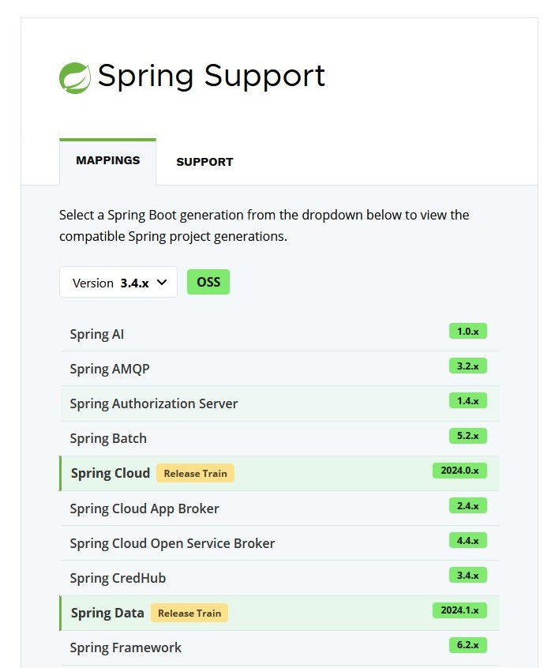

= Matrice des versions Spring Boot / Dependencies
:encoding: utf-8
:toc: auto
:toclevels: 3
:icons: font
:table-stripes: hover

== Historique Spring Boot 2.0+

|===
| Spring Boot ➡️ | Spring Boot 2.0 | Spring Boot 2.1 | Spring Boot 2.2 | Spring Boot 2.3 | Spring Boot 2.4 | Spring Boot 2.5 | Spring Boot 2.6 | Spring Boot 2.7 | Spring Boot 3.0 | Spring Boot 3.1 | Spring Boot 3.2 | Spring Boot 3.3 | Spring Boot 3.4 | Spring Boot 3.5 | Spring Boot 4.0 | Spring Boot 4.1

| Java baseline
| Java 8
| Java 8
| Java 8
| Java 8
| Java 8
| Java 8
| Java 8
| Java 8
| Java 17
| Java 17
| Java 17
| Java 17
| Java 17
| Java 17
| Java 17
| Java 17

| Spring Framework
| 5.0
| 5.1
| 5.2
| 5.2
| 5.3
| 5.3
| 5.3
| 5.3
| 6.0
| 6.0
| 6.1
| 6.1
| 6.2
| 6.2
| 7.0 footnote:[https://spring.io/blog/2024/10/01/from-spring-framework-6-2-to-7-0[From Spring Framework 6.2 to 7.0]]
| 7.0

| Spring Security
| 5.0
| 5.1
| 5.2
| 5.3
| 5.4
| 5.5
| 5.6
| 5.7
| 6.0
| 6.1
| 6.2
| 6.3
| 6.4
| 6.5
| 7.0
| 7.1

| Tomcat Embedded
| 8.5
| 9.0
| 9.0
| 9.0
| 9.0
| 9.0
| 9.0
| 9.0
| 10.1
| 10.1
| 10.1
| 10.1
| 10.1
| 10.1
| 11.0
| 11.0

| Spring Data JPA ⤵
| 2.0
| 2.1
| 2.2
| 2.3
| 2.4
| 2.5
| 2.6
| 2.7
| 3.0
| 3.1
| 3.2
| 3.3
| 3.4
| 3.5
| 4.0
| 4.1

| • Hibernate ORM
| 5.2
| 5.3
| 5.4
| 5.4
| 5.4
| 5.4
| 5.6
| 5.6
| 6.1
| 6.2
| 6.3-6.4 (since 3.2.1footnote:[Hibernate 6.4 introduced in v3.2.1. See details in https://github.com/spring-projects/spring-boot/issues/38870[#38870] and https://github.com/spring-projects/spring-boot/issues/38523[#38523].])
| 6.5
| 6.6
| 6.6
| 7.2 (since 4.0.1)
|

| Micrometer
| 1.0
| 1.1
| 1.3
| 1.5
| 1.6
| 1.7
| 1.8
| 1.9
| 1.10
| 1.11
| 1.12
| 1.13
| 1.14
| 1.15
| 1.16
| 1.17

| Spring Web Services ⤵
|
|
|
|
|
|
|
|
|
|
|
|
|
|
|
| 5.0

| • soap-api (SAAJ)
| --
| 1.4.0
| 1.4.1
| 1.4.2
| 1.4.2
| 1.4.2
| 1.4.2
| 1.4.2
| 3.0.0
| 3.0.0
| 3.0.0
| 3.0.1
| 3.0.2
| 3.0.2
|
|

| • ws-api (JAX-WS API)
| --
| 2.3.1
| 2.3.2
| 2.3.3
| 2.3.3
| 2.3.3
| 2.3.3
| 2.3.3
| 4.0.0
| 4.0.0
| 4.0.0
| 4.0.1
| 4.0.2
| 4.0.2
|
|

| • xml.bind-api (JAX-B)
| --
| 2.3.1
| 2.3.2
| 2.3.3
| 2.3.3
| 2.3.3
| 2.3.3
| 2.3.3
| 4.0.0
| 4.0.0
| 4.0.1
| 4.0.2
| 4.0.2
| 4.0.2
|
|

| • spring-ws-core
| 3.0.0
| 3.0.4
| 3.0.7
| 3.0.9
| 3.0.10
| 3.1.1
| 3.1.1
| 3.1.3
| 4.0
| 4.0
| 4.0
| 4.0
| 4.0
| 4.1
|
|

| Blog Post
| https://spring.io/blog/2018/03/01/spring-boot-2-0-goes-ga[👉]
| https://spring.io/blog/2018/10/30/spring-boot-2-1-0[👉]
| https://spring.io/blog/2019/10/16/spring-boot-2-2-0[👉]
| https://spring.io/blog/2020/05/15/spring-boot-2-3-0-available-now[👉]
| https://spring.io/blog/2020/11/12/spring-boot-2-4-0-available-now[👉]
| https://spring.io/blog/2021/05/20/spring-boot-2-5-is-now-ga[👉]
| https://spring.io/blog/2021/11/19/spring-boot-2-6-is-now-available[👉]
| https://spring.io/blog/2022/05/19/spring-boot-2-7-0-available-now[👉]
| https://spring.io/blog/2022/11/24/spring-boot-3-0-goes-ga[👉]
| https://spring.io/blog/2023/05/18/spring-boot-3-1-0-available-now[👉]
| https://spring.io/blog/2023/11/23/spring-boot-3-2-0-available-now[👉]
| https://spring.io/blog/2024/05/23/spring-boot-3-3-0-available-now[👉]
| https://spring.io/blog/2024/11/21/spring-boot-3-4-0-available-now[👉]
| https://spring.io/blog/2025/05/22/spring-boot-3-5-0-available-now[👉]
| https://spring.io/blog/2025/11/20/spring-boot-4-0-0-available-now[👉]
|

| Release Notes
| https://github.com/spring-projects/spring-boot/wiki/Spring-Boot-2.0-Release-Notes[🗒]
| https://github.com/spring-projects/spring-boot/wiki/Spring-Boot-2.1-Release-Notes[🗒]
| https://github.com/spring-projects/spring-boot/wiki/Spring-Boot-2.2-Release-Notes[🗒]
| https://github.com/spring-projects/spring-boot/wiki/Spring-Boot-2.3-Release-Notes[🗒]
| https://github.com/spring-projects/spring-boot/wiki/Spring-Boot-2.4-Release-Notes[🗒]
| https://github.com/spring-projects/spring-boot/wiki/Spring-Boot-2.5-Release-Notes[🗒]
| https://github.com/spring-projects/spring-boot/wiki/Spring-Boot-2.6-Release-Notes[🗒]
| https://github.com/spring-projects/spring-boot/wiki/Spring-Boot-2.7-Release-Notes[🗒]
| https://github.com/spring-projects/spring-boot/wiki/Spring-Boot-3.0-Release-Notes[🗒]
| https://github.com/spring-projects/spring-boot/wiki/Spring-Boot-3.1-Release-Notes[🗒]
| https://github.com/spring-projects/spring-boot/wiki/Spring-Boot-3.2-Release-Notes[🗒]
| https://github.com/spring-projects/spring-boot/wiki/Spring-Boot-3.3-Release-Notes[🗒]
| https://github.com/spring-projects/spring-boot/wiki/Spring-Boot-3.4-Release-Notes[🗒]
| https://github.com/spring-projects/spring-boot/wiki/Spring-Boot-3.5-Release-Notes[🗒]
| https://github.com/spring-projects/spring-boot/wiki/Spring-Boot-4.0-Release-Notes[🗒]
| https://github.com/spring-projects/spring-boot/wiki/Spring-Boot-4.1-Release-Notes[🗒]

| GitHub Release
| https://github.com/spring-projects/spring-boot/releases/tag/v2.0.0.RELEASE[🏷]
| https://github.com/spring-projects/spring-boot/releases/tag/v2.1.0.RELEASE[🏷]
| https://github.com/spring-projects/spring-boot/releases/tag/v2.2.0.RELEASE[🏷]
| https://github.com/spring-projects/spring-boot/releases/tag/v2.3.0.RELEASE[🏷]
| https://github.com/spring-projects/spring-boot/releases/tag/v2.4.0[🏷]
| https://github.com/spring-projects/spring-boot/releases/tag/v2.5.0[🏷]
| https://github.com/spring-projects/spring-boot/releases/tag/v2.6.0[🏷]
| https://github.com/spring-projects/spring-boot/releases/tag/v2.7.0[🏷]
| https://github.com/spring-projects/spring-boot/releases/tag/v3.0.0[🏷]
| https://github.com/spring-projects/spring-boot/releases/tag/v3.1.0[🏷]
| https://github.com/spring-projects/spring-boot/releases/tag/v3.2.0[🏷]
| https://github.com/spring-projects/spring-boot/releases/tag/v3.3.0[🏷]
| https://github.com/spring-projects/spring-boot/releases/tag/v3.4.0[🏷]
| https://github.com/spring-projects/spring-boot/releases/tag/v3.5.0[🏷]
| https://github.com/spring-projects/spring-boot/releases/tag/v4.0.0[🏷]
| https://github.com/spring-projects/spring-boot/releases/tag/v4.1.0[🏷]

|===

== Spring Support Mappings

Cette page officielle sur _spring.io_ permet de visualiser la liste des dépendances (seulement Spring) par version de Spring Boot :

* https://spring.io/projects/generations.

== Versions supportées actuellement / end of life

Voir : 

* https://spring.io/projects/spring-boot#support
* https://endoflife.date/spring-boot
